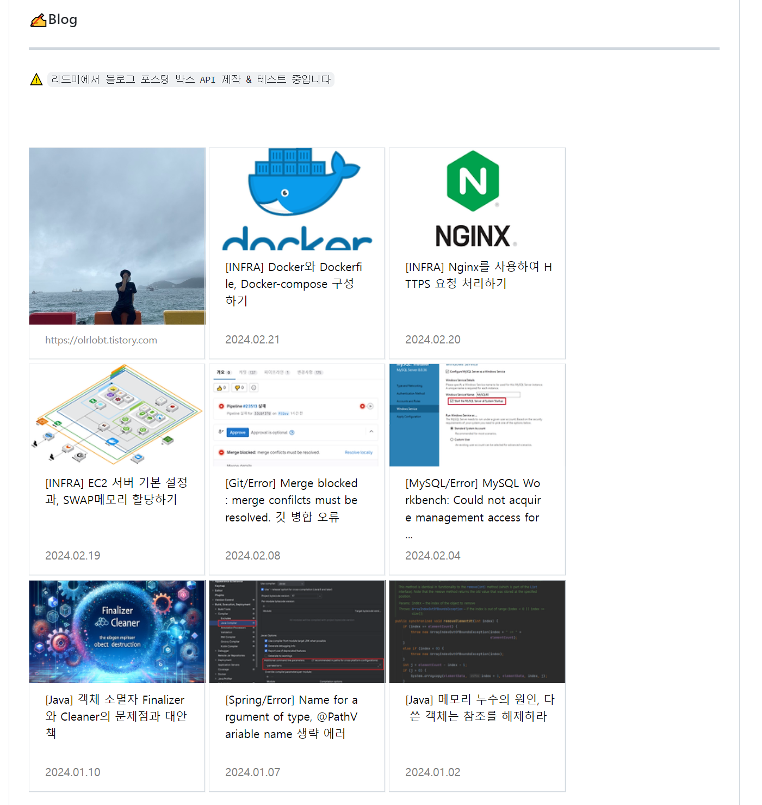

# Blog Widget for GitHub README

> GitHub README, 블로그 위젯 

### 깃허브 리드미에서 블로그를 쉽고 효과적으로 공유하세요!

이 서비스를 이용하면 최신 블로그 포스트를 GitHub 유저 README에서 쉽고 효과적으로 공유할 수 있습니다.
또한, 프로젝트 README 파일에 블로그 포스팅을 위젯처럼 표시하여 프로젝트와 관련된 추가 컨텐츠를 효과적으로 공유해 보세요.

어떤 식으로 보여지는지 [저의 깃허브 리드미](https://github.com/olrlobt)에서 바로 확인하실 수 있습니다! 


[](https://olrlobt.tistory.com/)


<br><br><br>

### 사용 화면 예시


<br>
<br>

## 시작하기

> 현재 1개의 테마를 지원 중입니다.\
> 2개의 블로그, 9개의 티스토리 테마에서 사용 가능합니다.\
> 테마를 임의로 수정하였다면 사용이 불가능할 수 있습니다.
> 
> 이 외의 블로그, 링크들은 고정형식만 사용할 수 있습니다.

- 사용 가능 테마 : Card
- 사용 가능 블로그 : Tistory, Velog
- 사용 가능 테마(Tistory) : 
  - Odyssey
  - Blue Club
  - 반응형#1
  - 반응형#2 
  - Poster
  - Whatever
  - Letter
  - Portfolio
  - __hELLO

<br>

플랫폼 태그 :
- Tistory - `t` , `tistory`
- Velog - `v`, `velog`

<br>

### 블로그 박스 위젯

해당 API를 호출하여, `markdown`에서 블로그를 쉽게 노출할 수 있습니다.


사용 방법 :

```markdown
[]({$링크})
[](https://olrlobt.tistory.com/)
```

예시:

[](https://olrlobt.tistory.com/)

<br>

### 포스팅 최신순 위젯

해당 API를 호출하여, `markdown` 파일에서 포스팅을 쉽게 최신순으로 노출할 수 있습니다.


사용 방법 :

```markdown
[](https://blogwidget.com/api/{$플랫폼}/link/{$번호}?name={$당신의 블로그 이름})
[](https://blogwidget.com/api/t/link/0?name=olrlobt)
```

예시:

[](https://blogwidget.com/api/t/link/0?name=olrlobt)

<br>
<br>


### 포스팅 고정 위젯

해당 API를 호출하여, `markdown` 파일에서 포스팅을 쉽게 고정할 수 있습니다.\
포스팅이 아니어도 어떤 웹 페이지도 위젯형식으로 고정이 가능합니다.

사용 방법 :
- 테마
  - b : BIG
  - none : defalut

```markdown
[]({$링크})
[](https://olrlobt.tistory.com/)

[](https://olrlobt.tistory.com/)
[](https://naver.com)
```

예시:

[](https://olrlobt.tistory.com/)
[](https://olrlobt.tistory.com/)
[](https://olrlobt.tistory.com/)

<br>
<br>


---


## 개발 노트

```text
24/03/11 - Tistory '반응형#2' 포스팅 박스
24/03/12 - Tistory 포스팅 바로가기
24/03/15 - 블로그 박스, 블로그 바로가기
24/03/18 - Tistory 'Blue Club' 서비스
24/03/19 - blogwidget.com 도메인 설정
24/03/24 - Velog 지원
24/03/24 - 포스팅 고정 위젯 추가
```

<br>
<br>

## 추가 예정

```text
Github.io, Naver Blog 지원 예정
여러가지 위젯 모양 지원 예정
게시물 1개만 효과적으로 표기하는 방법 지원 예정
```


